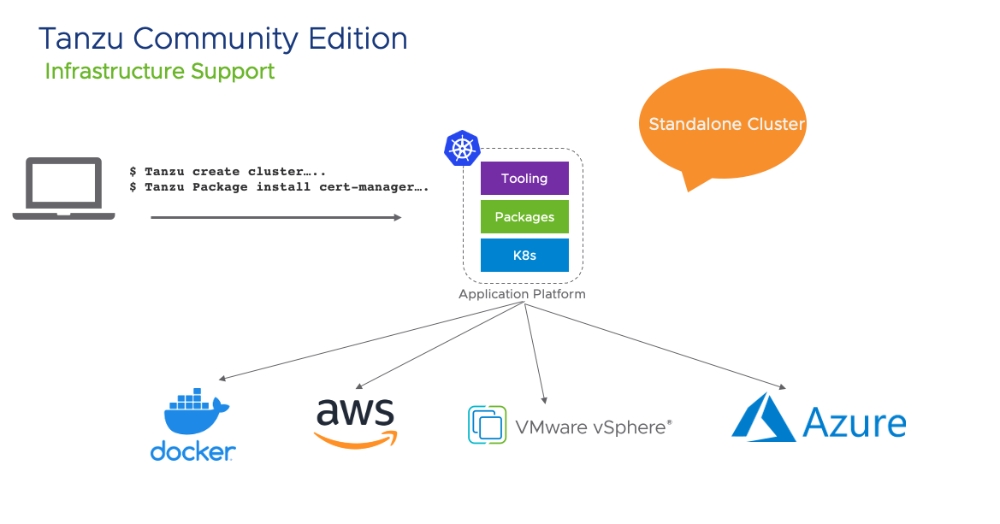
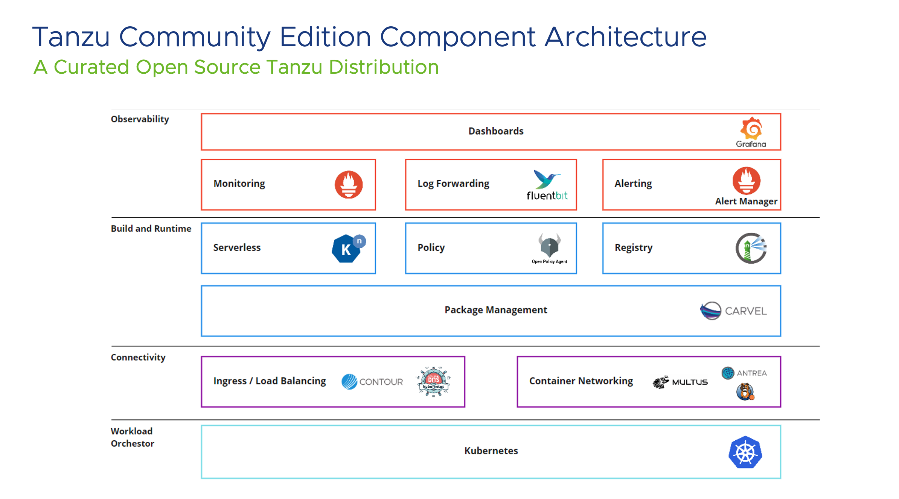

Tanzu Community Edition enables the creation of modern application platforms. These platfroms can be created on local laptops or various cloud and Infrastructure options. A platform deployed using tanzu Community edition provides a Kubernetes Run time, Tooling and additional repository of packages that can be installed/updated very easily.

Tanzu Community Edition is a freely available, Community supported Tanzu Platform. The Platform itself consists of various Open Source Software (OSS) to enable various functions.

Users can leverage **Tanzu CLI** to create a Kubernetes Cluster and add additional tooling to build and Deploy Modern Apps efficiently.

